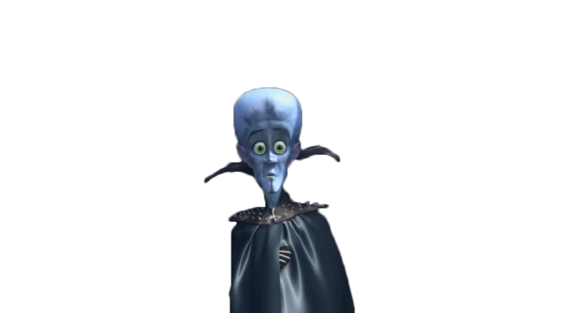
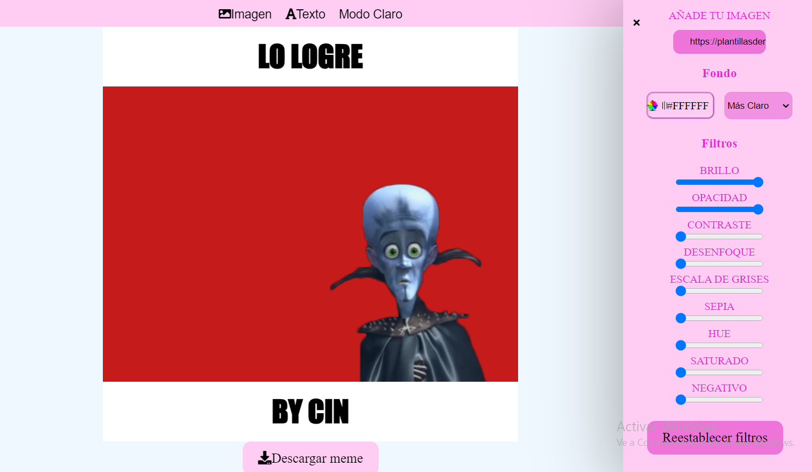

# Editor-de-memes

!**[Alt text](Aqui les muestro mi proyecto de editor de memes) **
la funcion es agregar al contenedor principal una imagen y luego modificar colores
de fondo filtros 
tambien esta el area de texto en el cual se edita el tipo de letra que les gustaria ponerle al texto superior y texto inferior de la imagen, y finalmente se descarga y se guarda en nuestro ordenador.
Aqui un ejemplo:

